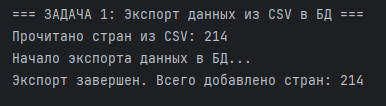
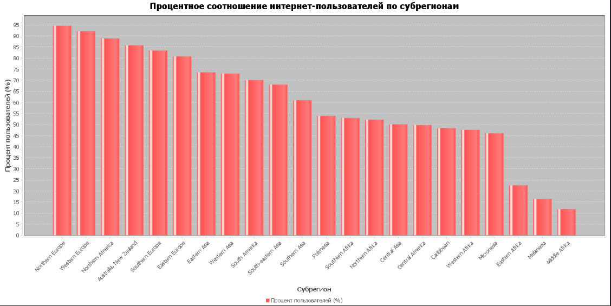
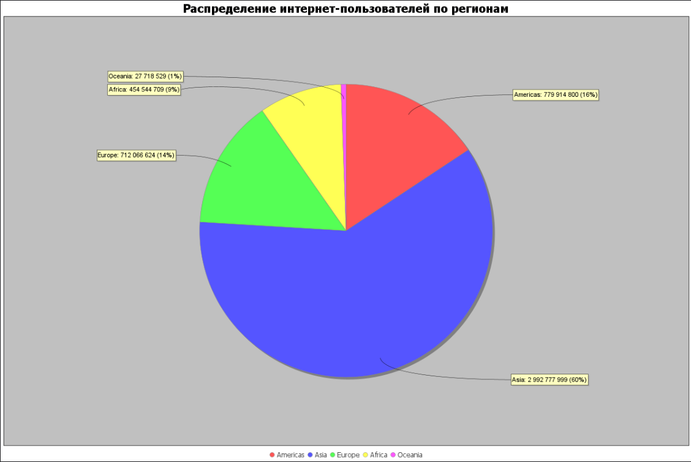

# Проект "Показатели стран" (project_1)

## Автор

Проект по дисциплине "Прикладное программирование" разработан:
- Студентом "Гарусс Михаил Александрович". 
- Группа "РИВ-330002д"

## Описание проекта

В этом проекте реализована система для хранения и обработки данных о странах по показателям интернет-пользователей и населения. Данные загружаются из CSV-файла, сохраняются в базу данных SQLite, а затем анализируются с помощью SQL-запросов.

**Технологии:**
- **Язык:** Java 21
- **База данных:** SQLite (схема 3NF)
- **Управление зависимостями:** Maven
- **Визуализация:** JFreeChart
- **Работа с CSV:** Apache Commons CSV

---

## Архитектура и реализация

### Компоненты системы

Проект реализован по модульному принципу с разделением ответственности:

#### 1. **Model Layer** — Модель данных
- [`Country.java`](src/main/java/org/example/model/Country.java) — POJO класс для представления страны
  - Поля: `id`, `name`, `subregion`, `internetUsers`, `population`, `percentage`
  - Геттеры/сеттеры, конструкторы

- [`Region.java`](src/main/java/org/example/model/Region.java) — Модель региона (для нормализации до 3NF)
  - Поля: `id`, `name`
  
- [`Subregion.java`](src/main/java/org/example/model/Subregion.java) — Модель субрегиона (для нормализации до 3NF)
  - Поля: `id`, `name`, `regionId`

#### 2. **Data Access Layer** — Работа с данными
- [`DatabaseManager.java`](src/main/java/org/example/db/DatabaseManager.java) — Управление подключением к SQLite
  - Создание/подключение к базе данных
  - Создание таблиц по схеме 3NF
  - Управление транзакциями и кэшированием регионов/субрегионов

- [`CSVParser.java`](src/main/java/org/example/parser/CSVParser.java) — Парсинг CSV файла
  - Чтение файла [`docs/Country.csv`](docs/Country.csv)
  - Преобразование числовых значений (удаление запятых)
  - Создание объектов Country

- [`DataExporter.java`](src/main/java/org/example/exporter/DataExporter.java) — Экспорт данных в БД
  - Импорт данных из CSV
  - Вставка записей в SQLite с использованием foreign keys

#### 3. **Business Logic Layer** — Логика анализа
- [`QueryExecutor.java`](src/main/java/org/example/query/QueryExecutor.java) — Выполнение SQL запросов
  - Задача 1: Процентное соотношение интернет-пользователей по субрегионам (с визуализацией)
  - Задача 2: Страна с наименьшим количеством интернет-пользователей в Восточной Европе
  - Задача 3: Страна с процентом пользователей от 75% до 85%

#### 4. **Presentation Layer** — Визуализация
- [`Visualizer.java`](src/main/java/org/example/visualize/Visualizer.java) — Построение диаграмм
  - Bar chart — распределение по интернет-пользователям
  - Pie chart — распределение по регионам
- [`Main.java`](src/main/java/org/example/Main.java) — Точка входа, координация работы компонентов

### Схема базы данных (3NF)

**Таблица `regions` (Регионы):**

| Поле | Тип | Описание |
|------|-----|----------|
| id | INTEGER PRIMARY KEY | Уникальный идентификатор |
| name | TEXT UNIQUE NOT NULL | Название региона |

**Таблица `subregions` (Субрегионы):**

| Поле | Тип | Описание |
|------|-----|----------|
| id | INTEGER PRIMARY KEY | Уникальный идентификатор |
| name | TEXT UNIQUE NOT NULL | Название субрегиона |
| region_id | INTEGER REFERENCES regions(id) | Внешний ключ к региону |

**Таблица `countries` (Страны):**

| Поле | Тип | Описание |
|------|-----|----------|
| id | INTEGER PRIMARY KEY AUTOINCREMENT | Уникальный идентификатор |
| name | TEXT NOT NULL | Название страны |
| subregion_id | INTEGER REFERENCES subregions(id) | Внешний ключ к субрегиону |
| internet_users | BIGINT | Количество интернет-пользователей |
| population | BIGINT | Население |

**Индексы:**
```sql
CREATE INDEX idx_countries_subregion ON countries(subregion_id);
CREATE INDEX idx_subregions_region ON subregions(region_id);
```

### Соответствие нормальным формам (3NF)

| Нормальная форма | Требование | Статус |
|-----------------|------------|--------|
| 1NF (Первая) | Атомарные значения | ✅ Выполнено |
| 2NF (Вторая) | Нет частичных зависимостей | ✅ Выполнено |
| 3NF (Третья) | Нет транзитивных зависимостей | ✅ Выполнено |

### Обработка данных

**Формат CSV файла:**
```
Country or area,Subregion,Region,Internet users,Population
China,Eastern Asia,Asia,"1,010,740,000","1,427,647,786"
India,Southern Asia,Asia,"833,710,000","1,352,642,280"
```

**Особенности парсинга:**
- Числовые поля содержат запятые как разделители тысяч
- Некоторые значения могут быть пустыми (обрабатываются как 0)
- Поля заключены в кавычки при необходимости

---

## Структура проекта

```
prodject_1/
├── pom.xml                                    # Конфигурация Maven
├── README.md                                  # Документация проекта
├── src/main/java/org/example/                 #
│   ├── Main.java                              # Главный класс приложения
│   ├── model/
│   │   ├── Country.java                       # Модель страны (POJO)
│   │   ├── Region.java                        # Модель региона (3NF)
│   │   └── Subregion.java                     # Модель субрегиона (3NF)
│   │
│   ├── db/
│   │   └── DatabaseManager.java              # Управление подключением к SQLite
│   │
│   ├── parser/
│   │   └── CSVParser.java                    # Парсинг CSV файла
│   │
│   ├── exporter/
│   │   └── DataExporter.java                 # Экспорт данных в БД
│   │
│   ├── query/
│   │   └── QueryExecutor.java                # Выполнение SQL запросов
│   │
│   └── visualize/
│       └── Visualizer.java                    # Визуализация данных (диаграммы)
├── src/main/resources/                        # Ресурсы приложения
├── src/test/java/                             # Тесты
├── docs/
│   ├── task.md                                # Задание проекта
│   ├── Country.csv                            # Исходные данные для импорта
│   └── ***                                    # Файлы в помощь реализации проекта
├── data/                                      
│   ├── chart_percentage_by_subregion.png      # Задача 1 (Процент по субрегионам) 
│   ├── chart_regions.png                      # Задача 1 (Процент по субрегионам) 
│   └── countries.db                           # База данных (создается при первом запуске)
└── output/                                    # Результаты выполнения задач
    ├── Задача_1_Percentage_By_Subregion.txt 
    ├── Задача_2_Lowest_Eastern_Europe.txt
    └── Задача_3_Percentage_Range.txt
    
```

---

## Зависимости

- **SQLite JDBC Driver** - драйвер для работы с базой данных SQLite
- **Apache Commons CSV** - библиотека для удобной работы с CSV файлами
- **JFreeChart** - библиотека для визуализации данных

---

## Инструкция по запуску

### Требования

Для работы проекта необходимо установить:

1. **Java Development Kit (JDK) 21+**
   - Скачать: https://www.oracle.com/java/technologies/javase/jdk21-downloads.html
   - Проверить установку: `java -version` и `javac -version`

2. **Maven**
   - Скачать: https://maven.apache.org/download.cgi
   - Добавить в PATH

### Шаги по запуску

#### Вариант 1: Использование Maven (рекомендуется)

```bash
# Перейти в папку проекта
cd prodject_1

# Скачать зависимости и скомпилировать проект
mvn clean compile

# Запустить приложение
mvn exec:java -Dexec.mainClass="org.example.Main"
```

#### Вариант 2: Ручная компиляция (без Maven)

```bash
# Перейти в папку проекта
cd prodject_1

# Создать папку для скомпилированных классов
mkdir target\classes

# Скомпилировать все Java файлы (в правильном порядке из-за зависимостей)
javac -d target/classes src/main/java/org/example/model/Country.java
javac -cp "target/classes" -d target/classes src/main/java/org/example/db/DatabaseManager.java
javac -cp "target/classes" -d target/classes src/main/java/org/example/parser/CSVParser.java
javac -cp "target/classes" -d target/classes src/main/java/org/example/exporter/DataExporter.java
javac -cp "target/classes" -d target/classes src/main/java/org/example/query/QueryExecutor.java
javac -cp "target/classes" -d target/classes src/main/java/org/example/visualize/Visualizer.java
javac -cp "target/classes" -d target/classes src/main/java/org/example/Main.java

# Запустить приложение
cd target\classes
java org.example.Main
```

#### Вариант 3: Из IDE (IntelliJ IDEA / Eclipse)

1. Открыть проект в IntelliJ IDEA или Eclipse
2. Убедиться, что настроен JDK 21+
3. Для Maven-проекта нажать "Reload All Maven Projects" (обновить зависимости)
4. Запустить класс `org.example.Main`

---

## Описание задач

Согласно заданию, необходимо выполнить следующие задачи:

### Задача 1: График процентного соотношения пользователей в интернете от всего населения по субрегионам
**Запрос:** Получить среднее процентное соотношение интернет-пользователей для каждого субрегиона

```sql
SELECT s.name as subregion,
       SUM(c.internet_users) as total_internet_users,
       SUM(c.population) as total_population,
       CAST(SUM(c.internet_users) AS REAL) * 100 / SUM(c.population) as percentage
FROM countries c
JOIN subregions s ON c.subregion_id = s.id
GROUP BY s.name
ORDER BY percentage DESC
```

**Визуализация:** Bar chart — распределение по интернет-пользователям

### Задача 2: Страна с наименьшим количеством зарегистрированных в ин-ете пользователей в Восточной Европе
**Запрос:** Найти страну с минимальным количеством интернет-пользователей среди субрегиона "Eastern Europe"

```sql
SELECT c.id, c.name, s.name as subregion, r.name as region,
       c.internet_users, c.population,
       CAST(c.internet_users AS REAL) * 100 / c.population as percentage
FROM countries c
JOIN subregions s ON c.subregion_id = s.id
JOIN regions r ON s.region_id = r.id
WHERE s.name = 'Eastern Europe'
ORDER BY c.internet_users ASC LIMIT 1
```


### Задача 3: Страна с процентом зарегистрированных в интернете пользователей в диапазоне от 75% до 85%
**Запрос:** Найти страну, чей процент интернет-пользователей находится в диапазоне 75-85%

```sql
SELECT c.id, c.name, r.name as region, s.name as subregion,
       c.internet_users, c.population,
       CAST(c.internet_users AS REAL) * 100 / c.population as percentage
FROM countries c
JOIN subregions s ON c.subregion_id = s.id
JOIN regions r ON s.region_id = r.id
WHERE (CAST(c.internet_users AS REAL) * 100 / c.population) BETWEEN 75 AND 85
```

---

## Результаты выполнения программы

При запуске программа выводит:

1. **Экспорт данных:**
   - Количество прочитанных стран из CSV
   - Количество добавленных записей в БД
   - 

2. **Задача 1 (график):** Процентное соотношение интернет-пользователей по субрегионам
   - Результат сохраняется в файл [`output/Задача_1_Percentage_By_Subregion.txt`](output/Задача_1_Percentage_By_Subregion.txt)
   - График сохраняется в [`data/chart_percentage_by_subregion.png`](data/chart_percentage_by_subregion.png)
   - Визуализация выполняется классом [`Visualizer.java`](src/main/java/org/example/visualize/Visualizer.java)
     
     

3. **Задача 2:** Страна с наименьшим количеством интернет-пользователей в Восточной Европе
   - Результат сохраняется в файл [`output/Задача_2_Lowest_Eastern_Europe.txt`](output/Задача_2_Lowest_Eastern_Europe.txt)

4. **Задача 3:** Страна с процентом интернет-пользователей от 75% до 85%
   - Результат сохраняется в файл [`output/Задача_3_Percentage_Range.txt`](output/Задача_3_Percentage_Range.txt)

---
